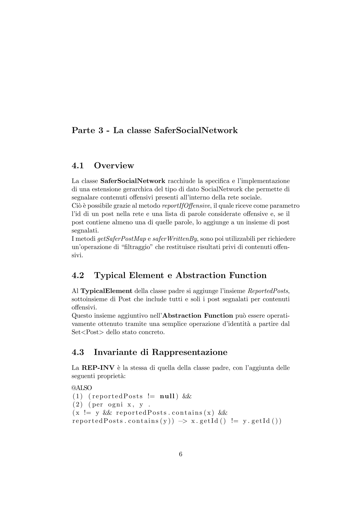

# SaferSocialNetwork

Programmazione II - A.A. 2020/21
      1° Progetto Intermedio

     Luca Lombardo - Mat. 546688
     
Introduzione

1.1     Il progetto
Il presente progetto consiste in una componente software di supporto alla
gestione e all’analisi di una rete sociale. Esso è costituito da sei file .java,
uno per ogni classe:
   1. la classe Post comprende la specifica e l’implementazione del tipo di
      dato rappresentante un singolo post all’interno della rete sociale;
   2. la classe SocialNetwork comprende la specifica e l’implementazione
      della struttura dati rappresentante la rete sociale in sé;
   3. la classe SaferSocialNetwork è un’estensione gerarchica della classe
      SocialNetwork che introduce la possibilità di segnalare i contenuti of-
      fensivi;
   4. la classe BrokenInvariantException definisce un tipo di eccezione
      unchecked normalmente non presente in Java;
   5. la classe Test è costituita da metodi statici che verificano la correttezza
      dell’implementazione delle classi precedentemente definite;
   6. la classe Main contiene il metodo main e richiama al suo interno i
      metodi della classe Test.

1.2     Istruzioni per l’esecuzione
Per compilare il progetto è sufficiente utilizzare il comando javac con sei
argomenti (uno per ogni file .java):
javac Main.java Test.java Post.java SocialNetwork.java
      SaferSocialNetwork.java BrokenInvariantException.java
Per eseguire la batteria di test, è necessario utilizzare il comando java con
l’aggiunta del parametro -ea affinché le asserzioni funzionino correttamente:
java -ea Main

Parte 1 - La classe Post

2.1      Overview
La classe Post racchiude la specifica e l’implementazione di un tipo di dato
non modificabile (immutable) rappresentante un singolo post all’interno di
una rete sociale.

La non modificabilità della classe ha come vantaggio la possibilità per i
metodi che restituiscono un oggetto di tipo Post di evitare operazioni di
copy-out (copia difensiva in uscita).

Allo scopo di rendere la classe immutable:

      tutte le variabili di stato sono dichiarate come private final ;

      non è stato implementato alcun metodo modificatore (mutator );

      la classe è definita come final in modo da non permettere estensioni
       gerarchiche di essa.

2.2      Typical Element e Abstraction Function
La Funzione di Astrazione si comporta da identità sui primi tre argomenti
e associa l’oggetto di tipo Date alla sua rappresentazione come stringa.
Operativamente, ciò può essere ottenuto tramite l’invocazione del metodo
timestamp.toString().

2.3      Invariante di Rappresentazione
La REP-INV della classe Post, riportata formalmente all’interno del file
d’implementazione è la seguente:

       (1)        ( t e x t != null ) &&
       (2)        ( a u t h o r != null ) &&
       (3)        ( timestamp != null ) &&
      (4)        ( i d > 0 ) &&
      (5)        ( 0 < t e x t . l e n g t h ( ) <= 1 4 0 )

Le proprietà (1), (2) e (3) garantiscono banalmente che nessuna variabile
di stato sia uguale a null.
La proprietà (4) stabilisce che l’id debba necessariamente essere un numero
positivo e la (5) che il testo del post abbia una lunghezza compresa tra 1 e
140 caratteri.

La scelta di forzare text.length() > 0 (e non anche = 0) è stata guidata
dalla considerazione che, non essendo permessi altri tipi di contenuti (per
es. multimediali), in nessun caso avrebbe avuto senso creare un post com-
pletamente vuoto.

Il metodo privato checkRep, che solleva una BrokenInvariantException nel
caso la RI non sia verificata, viene chiamato all’interno di tutti i metodi,
compresi quelli che non modificano lo stato: questo facilita l’individuazione
di eventuali esposizioni della rappresentazione interna, che potrebbero portare
a una violazione della RI.

2.4     Note aggiuntive
Il metodo getTimestamp, osservatore che restituisce data e ora della creazione
del post, effettua un’operazione di copy-out poiché l’oggetto restituito è di
tipo Date ed in quanto tale è modificabile.
Gli altri metodi osservatori non necessitano di copy-out poiché restituiscono
valori di tipo primitivo (int) o comunque immutable (String).

Il metodo equals della classe Object è stato sovrascritto affinché due post
siano considerati uguali se e solo se hanno lo stesso id.
La sovrascrittura di equals ha richiesto la sovrascrittura anche del metodo
hashCode per rispettarne il contratto d’uso e garantire che la struttura dati
funzioni correttamente in tutte le collezioni basate su hash.

Parte 2 - La classe SocialNetwork

3.1     Overview
La classe SocialNetwork racchiude la specifica e l’implementazione di una
struttura dati modificabile rappresentante una rete sociale. Consente agli
utenti di inviare messaggi lunghi al più 140 caratteri e di lasciare like ai post
degli altri utenti.
Un like è un particolare post p1 il cui testo è nel formato: “like:id”, dove id
è un numero intero corrispondente all’id di un qualche altro post p2.
Se l’autore del post p1 mette un like a un post p2, egli incomincia a ”seguire”
l’autore di p2 (ne diventa un follower ).
Gli utenti non possono seguire sé stessi, di conseguenza non è permesso
mettere like a un proprio post.

3.2     Typical Element e Abstraction Function
L’Abstraction Function associa la mappa postMap di tipo
<String, Set<Post>> ad un insieme di Post, eliminando completamente le
chiavi: questo è possibile poiché l’autore del post è un’informazione presente
all’interno del post stesso. Il risultato equivale a ciò che si otterrebbe oper-
ativamente dalla chiamata del metodo postMap.values().

L’insieme Followers (secondo componente del Typical Element) è invece
ottenuto a partire dalla mappa followedMap “srotolando” l’insieme associ-
ato ad ogni chiave e creando cosı̀ un insieme di coppie. Operativamente ciò
equivale a chiamare il metodo followedMap.entrySet().

3.3     Invariante di Rappresentazione
La REP-INV della classe SocialNetwork, riportata formalmente all’interno
del file d’implementazione è la seguente:

[vedi relazione.pdf]

La proprietà (1) garantisce che le variabili di stato siano diverse da null
e che il numero di post presenti nella rete sociale sia sempre positivo (può
essere uguale a zero in caso di rete vuota).
La proprietà (2) stabilisce che non possono esistere due post all’interno della
rete sociale con lo stesso id.
Le proprietà (3) e (4) impediscono che un autore possa seguire sé stesso.

Si assume valida la REP-INV della classe Post.

Il metodo checkRep (dichiarato come protected poiché utilizzato anche
all’interno della classe figlio SaferSocialNetwork ) viene chiamato all’interno
di ogni metodo non statico.

3.4     Note aggiuntive
La variabile concreta numPost viene utilizzata per generare univocamente
gli id durante la creazione dei post: essa viene inizializzata a 0 e incremen-
tata di volta in volta. Non essendo possibile la rimozione di un post, essa
indica anche il numero di post presenti nella rete sociale in ogni momento.

La variabile concreta followersMap è una mappa speculare a followedMap
che si è deciso di realizzare unicamente per motivi di efficienza nell’esecuzione
di alcuni metodi (getFollowers, guessFollowers e influencers).

I metodi guessFollowers, guessFollowed, getMentionedUsers e writ-
tenBy che non dipendono dallo stato interno sono stati resi statici in modo
da poter essere chiamati senza necessità di istanziare un oggetto di tipo
SocialNetwork. Questi metodi, insieme ad altri della classe SaferSocialNet-
work, presentano al loro interno delle chiamate al metodo statico protected
postRepOk, che verifica l’univocità degli id nella lista di post passata come
parametro.

Parte 3 - La classe SaferSocialNetwork

4.1       Overview
La classe SaferSocialNetwork racchiude la specifica e l’implementazione
di una estensione gerarchica del tipo di dato SocialNetwork che permette di
segnalare contenuti offensivi presenti all’interno della rete sociale.
Ciò è possibile grazie al metodo reportIfOffensive, il quale riceve come parametro
l’id di un post nella rete e una lista di parole considerate offensive e, se il
post contiene almeno una di quelle parole, lo aggiunge a un insieme di post
segnalati.
I metodi getSaferPostMap e saferWrittenBy, sono poi utilizzabili per richiedere
un’operazione di “filtraggio” che restituisce risultati privi di contenuti offen-
sivi.

4.2       Typical Element e Abstraction Function
Al TypicalElement della classe padre si aggiunge l’insieme ReportedPosts,
sottoinsieme di Post che include tutti e soli i post segnalati per contenuti
offensivi.
Questo insieme aggiuntivo nell’Abstraction Function può essere operati-
vamente ottenuto tramite una semplice operazione d’identità a partire dal
Set<Post> dello stato concreto.

4.3       Invariante di Rappresentazione
La REP-INV è la stessa di quella della classe padre, con l’aggiunta delle
seguenti proprietà:

      [vedi relazione.pdf]

La proprietà (1) garantisce banalmente che l’insieme concreto dei post seg-
nalati non sia mai uguale a null, mentre la (2) stabilisce che non possono
esistere due post segnalati con lo stesso id.

Per garantire che la RI sia rispettata in ogni momento, all’interno di ogni
metodo non statico vengono chiamati checkRep della classe padre e check-
SaferRep (che verifica la parte @ALSO).

4.4    Note aggiuntive
Le operazioni di filtraggio dei contenuti offensivi sono state realizzate con
metodi nuovi invece che facendo un @Override dei metodi della classe padre;
ciò permette di utilizzare un oggetto di tipo SaferSocialNetwork esattamente
come se fosse un oggetto di tipo SocialNetwork. Il principio di sosti-
tuzione di Liskov è quindi rispettato.

Si sarebbero potute implementare le segnalazioni come un tipo particolare
di post. Si è però deciso di non seguire questa via perché si vuole che le
segnalazioni siano anonime o comunque non visibili a tutti, mentre i post
sono, per definizione, pubblici all’interno della rete sociale.

                                                             Luca Lombardo
                                                               Mat. 546688
                                                                29/11/2020

